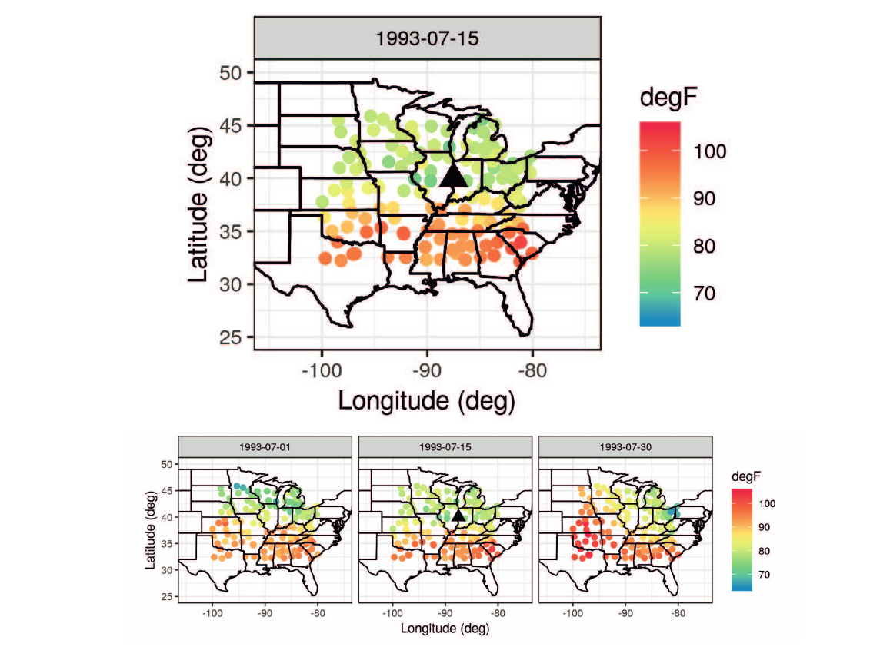
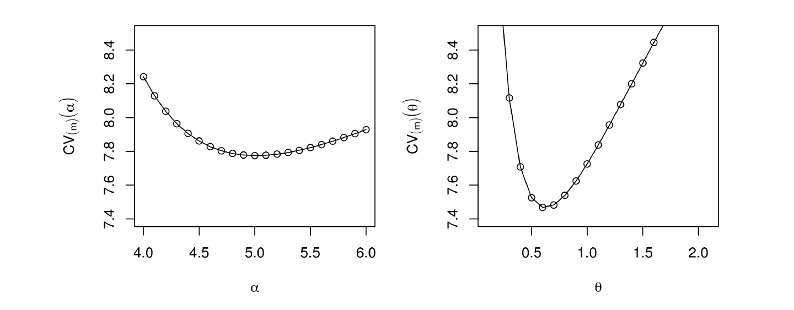
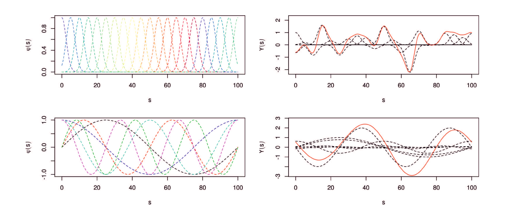
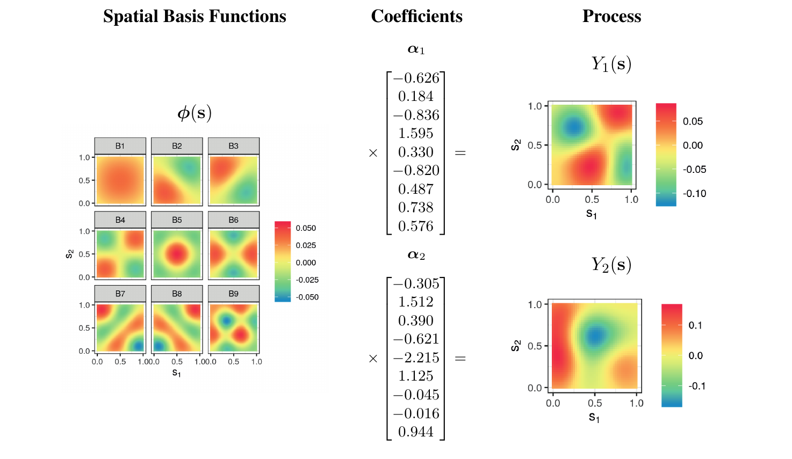
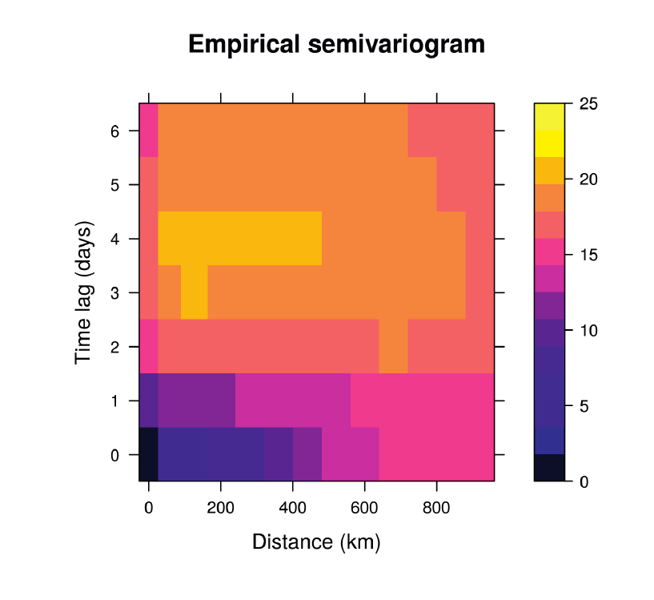

```{r echo=FALSE}
library(tidyverse)
library(viridis)
library(STRbook)

knitr::opts_chunk$set(echo = FALSE,
                      fig.align = "center",
                      dpi = 300,
                      fig.height = 5)
```

# Three goals

```{r echo=FALSE}
dat <- tibble(x = runif(100 * 3),
              y = runif(100 * 3),
              t = factor(rep(1:3, each = 100), levels = 1:4),
              val = x + rnorm(100 * 3, 0, 0.2))

p <- ggplot(dat, aes(x = x, y = y, color = val)) +
  geom_point() +
  coord_equal() +
  scale_color_viridis(option = "E") +
  guides(color = FALSE) +
  theme_bw() +
  theme(axis.title = element_blank(),
        axis.ticks = element_blank(),
        axis.text = element_blank())
p + facet_wrap(~ t, ncol = 2L, drop = TRUE)
```

---

# Prediction

```{r}
pred_df <- tibble(x = 0.5,
                  y = 0.5,
                  t = 3)
p + facet_wrap(~ t, ncol = 2L, drop = TRUE) +
  geom_point(aes(x = x, y = y), data = pred_df,
             shape = 8, size = 5, inherit.aes = FALSE)
```

---

# Inference

```{r}
p + facet_wrap(~ t, ncol = 2L, drop = TRUE)
```

---

# Inference

```{r}
ggplot(dat, aes(x = x, y = val)) +
  geom_smooth(method = lm, se = FALSE, col = "black") +
  geom_point(aes(col = t)) +
  guides(color = FALSE) +
  labs(x = "Covariate", y = "Value") +
  theme_bw()
```

---

# Forecasting

```{r}
p + facet_wrap(~ t, ncol = 2L, drop = TRUE)
```

---

# Forecasting

```{r}
pred_df2 <- tibble(x = 0.5,
                   y = 0.5,
                   t = factor(4, levels = 1:4))
p + facet_wrap(~ t, ncol = 2L, drop = FALSE) +
  geom_point(aes(x = x, y = y), data = pred_df2,
             shape = 8, size = 5, inherit.aes = FALSE)
```

---

# Tobler's law

Close observations will be more similar than distant observations

---

# Deterministic prediction

```{r dpi=72}

```

---

# Deterministic prediction

Inverse distance weighting

$$Z(s_0, t_0) = \sum_{j=1}^T \sum_{i=1}^{m_j} w_{ij}(s_0, t_0) Z(s_{ij}, t_j)$$

$$w_{ij}(s_0,t_0) = \frac{\tilde{w}_{ij}(s_0,t_0)}{\sum_{k=1}^T\sum_{\ell=1}^{m_k}\tilde{w}_{\ell k}(s_0,t_0)}$$

$$\tilde{w}(s_0,t_0) = \frac{1}{d((s_{ij}, t_j), (s_0,t_0))^\alpha}$$

---

# Deterministic prediction

- Weights depend on distance in space and time.
- $d$ is a distance measure
- This is an exact interpolator
- $\alpha$ determines smoothness (lower is smoother)

---

# Kernel functions

Generalization of inverse distance weighting,

$$\tilde{w}_{ij}(s_0,t_0) = k((s_{ij}, t_j), (s_0,t_0);\alpha)$$

Another example is the squared-exponential kernel:

$$k((s_{ij}, t_j), (s_0,t_0); \theta) = \exp\left(-\frac{1}{\theta} d((s_{ij}, t_j), (s_0,t_0))^2\right)$$

---

# Cross-validation

Often used for choosing kernel parameters.

```{r dpi=72}

```

---

# Trend/regression estimation

Can include covariates

$$Z(s_i,t_j) = \beta_0 + \beta_1 X_1(s_i,t_i) + \cdots + \epsilon(s_i,t_i)$$

$$\epsilon \sim \operatorname{Normal}(0, \sigma^2)$$

---

# Basis functions

- Essentially a special type of covariate.
- Can be local or global
- Deterministic

```{r dpi=72}

```

---

# Basis functions

```{r dpi=72}

```

---

# Diagnostics: dependent errors

```{r}

```

# Diagnotsics: dependent errors

Temporal: Durbin-Watson

$$ 
---

# Inference

---

# Model selection

---

# Forecasting

---

# Non-Gaussian errors

---

# GLMs and GAMs

---

# Hierarchical spatio-temporal statistical models
